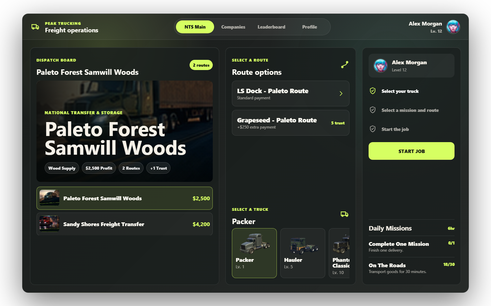

# Peak Trucking

[](LICENSE)
[](version.json)
[](https://discord.gg/gAqXUaVEMn)

Peak Trucking is a premium open-source FiveM trucking resource with persistent driver progression, company trust, daily missions, leaderboards, legal freight, optional illegal cargo, and a React-based NUI dispatch tablet.



## Features

- Mission and route selection with truck level requirements
- Company trust points and mission unlocks
- Driver XP, levels, completed jobs, earnings, and recent work history
- Daily mission progress and reset handling
- Leaderboard data stored in SQL
- Optional illegal cargo side job
- Framework support for QBCore and ESX (modern and legacy)
- Inventory support for `ox_inventory`, `qb_inventory`, `esx_inventory`, and `qs_inventory`
- Interaction support for `drawtext`, `ox_target`, `qb_target`, `qb_textui`, and `esx_textui`
- Vite React + TypeScript NUI built into `ui/dist`

## Dependencies

- `oxmysql`
- A supported framework: QBCore or ESX
- Optional inventory/interaction resources based on your configuration

## Installation

### 🤖 AI-First Setup (Recommended)
If you are using an AI coding assistant (like Claude, ChatGPT, or Cursor), you can set up this resource in seconds:
1. Open [PROMPT.md](PROMPT.md).
2. Copy the content and paste it into your AI assistant.
3. Follow its instructions to automatically configure the framework, inventory, key system, and database for your server.

### Manual Setup
1. Place this folder in your server resources as `peak-trucking`.
2. Import [install/install.sql](install/install.sql) into your database.
3. Configure [shared/config.lua](shared/config.lua) and [server/server-config.lua](server/server-config.lua).
4. Ensure dependencies before this resource:

```cfg
ensure oxmysql
ensure peak-trucking
```

## UI Development

The source NUI app is in [ui](ui). Build it before release:

```powershell
cd ui
npm install
npm run build
```

The FiveM manifest loads `ui/dist/index.html`. Keep `ui/dist` in release archives and do not include `ui/node_modules`.

## Configuration

- **[shared/config.lua](shared/config.lua)**: Framework, SQL driver, inventory, interactions, vehicles, missions, fuel, keys, XP, and gameplay settings.
- **[shared/language.lua](shared/language.lua)**: UI and gameplay text strings.
- **[server/server-config.lua](server/server-config.lua)**: Server-only optional settings such as Discord bot token and version checks.

## Publishing Notes

- Do not publish live Discord bot tokens or credentials.
- Keep `ui/dist` committed or packaged for server use.
- Do not include `ui/node_modules` in releases.
- Review mission coordinates and item names before publishing a server-specific fork.

## Contributing

Contributions are welcome. Please read [CONTRIBUTING.md](CONTRIBUTING.md) and [CODE_OF_CONDUCT.md](CODE_OF_CONDUCT.md) before opening issues or pull requests.
